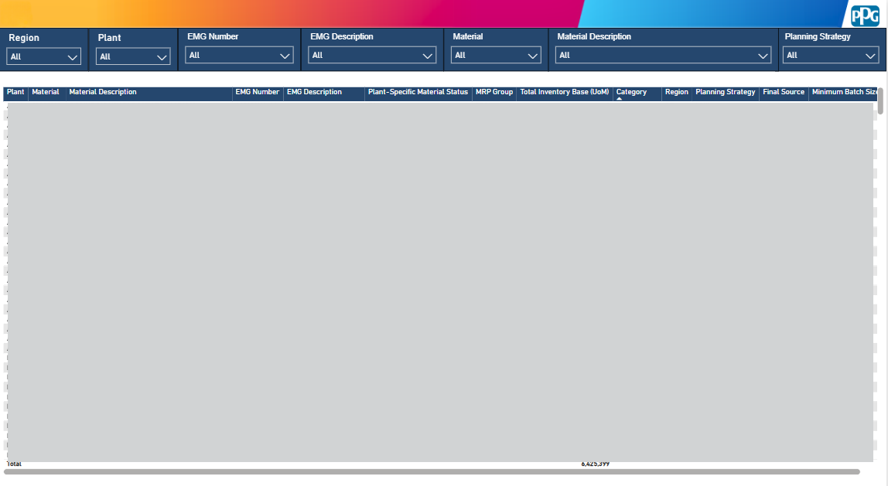
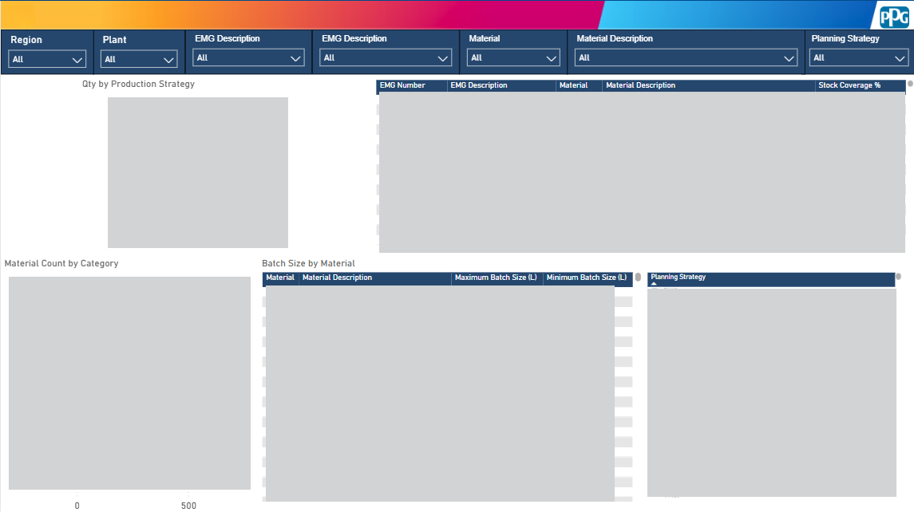
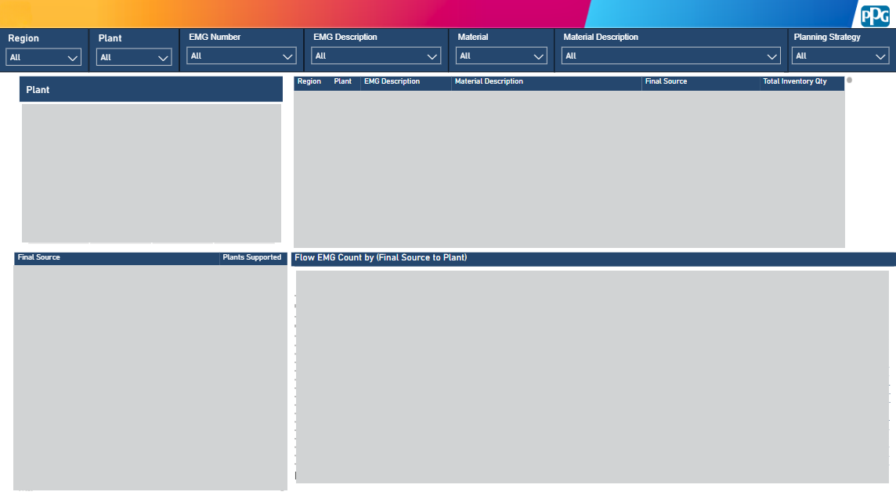

## 📊 Product Management Dashboard (SAP Datasphere & Power BI)

### 🚀 Project Overview

This project presents the end-to-end development of an enterprise-grade Product Management Dashboard, completed as an **industry-based Final Year Project in collaboration with PPG Coatings (Malaysia) Sdn. Bhd**. It was built to solve the challenges of fragmented reporting logic and a heavy reliance on manual Excel uploads for data integration. By establishing a governed, centralized analytical layer, the solution extracts and processes operational data directly from the enterprise system to provide actionable insights for product, inventory, sourcing, and production analysis. 

  

### 🎯 Business Objectives

The primary goal is to provide consistent, traceable, and centralized reporting for business stakeholders. 

#### Key Deliverables:
* **Data Integration:** Combine enterprise data from core SAP tables.
* **Centralized Business Logic:** Perform data cleansing, categorization, and rule application within a governed semantic layer.
* **Seamless Connectivity:** Bridge the data warehouse with reporting tools using ODBC and HANA Database connectors.
* **Interactive Analytics:** Deliver user-friendly dashboards for stock coverage, supply network mapping, and product overview.

### 🌟 Business Impact & Value Delivered

* **Targeted Regional Value:** Specifically tailored to support demand planning, stock coverage tracking, and operational visibility for Protective & Marine Coatings (PMC) stakeholders across the EMEA region.
* **Automated Data Pipelines:** Replaced error-prone manual Excel uploads with direct system data (e.g., pulling External Material Group data directly from the MARA table), ensuring 100% data accuracy and eliminating visualization errors.
* **Secure, Scalable Access:** Designed dynamic Row-Level Security (RLS) using email-based mapping. This replaced rigid static technical users, enabling secure, scalable Data Access Control tailored to regional business users.
* **Single Source of Truth:** Unified previously fragmented reporting into a single, governed semantic layer, drastically reducing the time required for data preparation and reconciliation.

### 🧰 Tech Stack

| Technology | Purpose |
| :--- | :--- |
| **SAP HANA** | Primary enterprise data source (Operational Data). |
| **SAP Datasphere** | Data integration, transformation, and semantic modeling layer. |
| **SQL** | Complex business rule derivations and calculated columns. |
| **Microsoft Power BI** | Front-end interactive dashboard and visualization. |
| **ODBC / DirectQuery** | Data connectivity for optimized consumption. |

### 🏗️ System Architecture & Data Modeling

The data engineering pipeline leverages a strict layered modeling architecture in SAP Datasphere to ensure data integrity and traceability:

1.  **Inbound Layer:** Near-source replication of raw SAP tables.
2.  **Harmonization Layer:** Standardization of fields, filtering, and preparation of reusable views.
3.  **Propagation Layer:** Complex joins and business derivations.
4.  **Fact Layer:** Definition of analytical facts and core measures like *Total Inventory Value* and *Safety Stock Value*.
5.  **Reporting Layer:** The final consumption-ready analytic model exposed to Power BI.

---

### 📈 Dashboard Features

The Power BI consumption layer is divided into three highly interactive pages. 

#### 📌 1. Product Management Overview
A detailed tabular report providing product-level visibility across the network. The core table displays key operational attributes including Plant-Specific Material Status, MRP Group, Total Inventory Base (UoM), Category, Final Source, and Minimum Batch Size.

  

#### 📦 2. Stock Coverage Ratio
Focuses on inventory sufficiency and production metrics. This page features visual breakdowns for "Qty by Production Strategy" and "Material Count by Category." It also includes detailed tables displaying Stock Coverage % by material, as well as Maximum and Minimum Batch Sizes (L) to support precise inventory planning.

  

#### 🌍 3. Supply Network Map
Provides comprehensive visibility into sourcing relationships across the supply chain. This page features a dedicated "Flow EMG Count by (Final Source to Plant)" visualization to trace material distribution. It is supported by detailed tables mapping Final Sources to the specific Plants Supported, alongside granular data on Total Inventory Qty by Region and Final Source.

  

---
*Developed as part of a Bachelor of Computer Science (Data Engineering) Final Year Project.*
